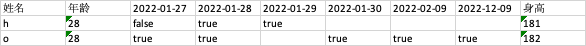

# excel 表格导入导出

eg:

```
type AdExport struct {
	Id           int64  `excel:"ID"`
	Name         string `excel:"广告创意"`
	Status       string `excel:"投放状态"`
	AdGroup      string `excel:"广告组（ID）"`
	Campaign     string `excel:"广告计划（ID）"`
	CreativeType string `excel:"广告类型"`
	SettleType   string `excel:"计费类型"`
	Imp          int64  `excel:"当日曝光"`
	TotalImp     int64  `excel:"总曝光"`
	Clk          int64  `excel:"当日点击"`
	TotalClk     int64  `excel:"总点击"`
	ClickRatio   string `excel:"点击率"`
	CPM          string `excel:"CPM单价"`
	CPC          string `excel:"CPC单价"`
	Charge       string `excel:"当日花费"`
	TotalCharge  string `excel:"总花费"`
}

func AdExport(ctx context.Context, req *adProto.SearchAdRequest) (*commonProto.ExcelResponse, error) {
	// 网关根据当前结构体来判断是否为excel导出
	resp := &commonProto.ExcelResponse{
		Code:         0,
		ErrorMessage: "success",
		Data: &commonProto.Excel{
			FileName: "广告创意",
		},
	}
	req.Page = -1
	_, list, err := impl.adService.Search(ctx, convert.AdConvert.FromSearchPb(req))
	if err != nil {
		resp.Code = -1
		resp.ErrorMessage = err.Error()
		return resp, nil
	}
	excel := common.NewExcel() 
	// 添加sheet1
	sheet1, err := excel.AddSheet("广告创意")
	if err != nil {
		return nil, err
	}
	if err = sheet1.AddData(convert.AdConvert.ToExportList(list)); err != nil {
		return nil, err
	}
	// 添加sheet2
	sheet2, err := excel.AddSheet("收数链接")
	if err != nil {
		return nil, err
	}
	if err = sheet2.AddData(convert.AdConvert.ToRxdTrackingList(list)); err != nil {
		return nil, err
	}
	if resp.Data.Raw, err = excel.Bytes(); err != nil {
		return nil, err
	}
	return resp, nil
}
```

excel 导出
- grpc之间的数据传递，字节流 excel.Bytes() 传输给www
- http与客户端之间的数据传递，www通过`commonProto.ExcelResponse`类型断言是否为excel导出

## 导出扩展字段

```
type foo struct {
	Name    string          `excel:"姓名"`
	Age     *int            `excel:"年龄,allowempty"`
	Holiday map[string]bool `excel:"假期,expand:date"`
	Height  int             `excel:"身高"
}
```

扩展字段支持2种类型，单个以及多个随意扩容字段

一、allowempty, 单个指针类型字段, nil就不会生成该字段，例如权限控制，前台只允许看到总曝光,总花费 可以将其他的字段设为指针并且为nil

二、expand, 多个扩容字段, `map[string]interface{}` , 例如 日期:

如果每一行的扩展字段不确定，以最长做为表头



## 导入扩展字段识别

扩展字段是通过正则来识别的表头的

```
type foo struct {
	Name    string          `excel:"姓名"`
	Age     *int            `excel:"年龄,allowempty"`
	Holiday map[string]bool `excel:"假期,expand:regexp(^\\d{4}-\\d{2}-\\d{2}$)"`
	Height  int             `excel:"身高"`
}

type foo2 struct {
	Name    string          `excel:"姓名"`
	Age     *int            `excel:"年龄,allowempty"`
	Holiday map[string]bool `excel:"假期,expand:regexp(^\\d{4}-\\d{2}-\\d{2}$)"`
	Height  int             `excel:"身高"`
}
```

内置正则：

- expand:date `2022-02-11`
- expand:datetime `2022-02-11 10:42:00`
- expand:month `2022-02`

自定义正则：

- expand:regexp(^\\d{4}-\\d{2}-\\d{2}$) 等价于 expand:date

> 注意反斜杠是写在tag中的，需要双斜杠，这样才可以正常编译

# excel 修改原文件
